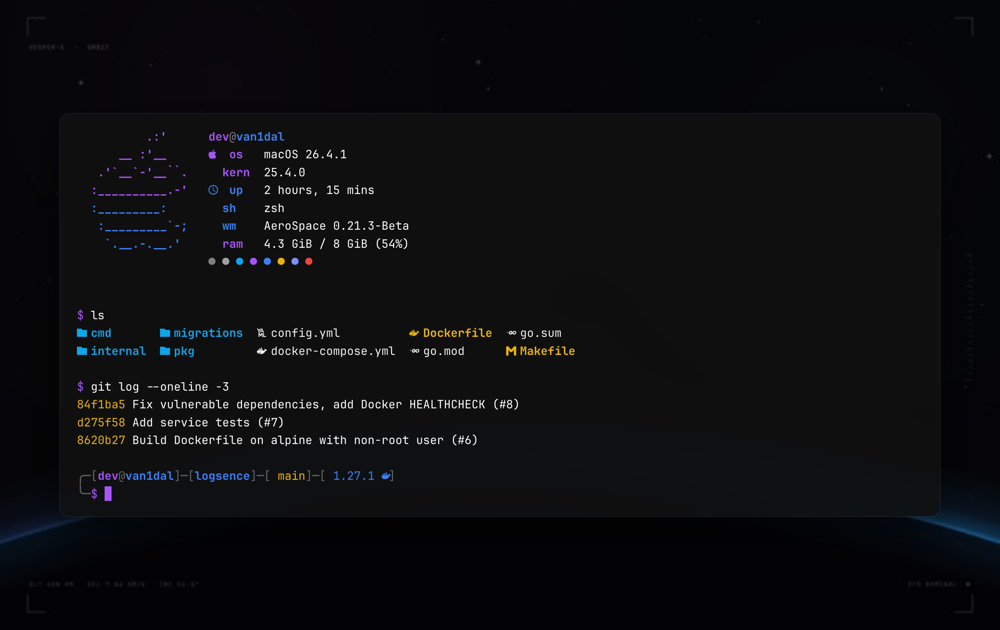
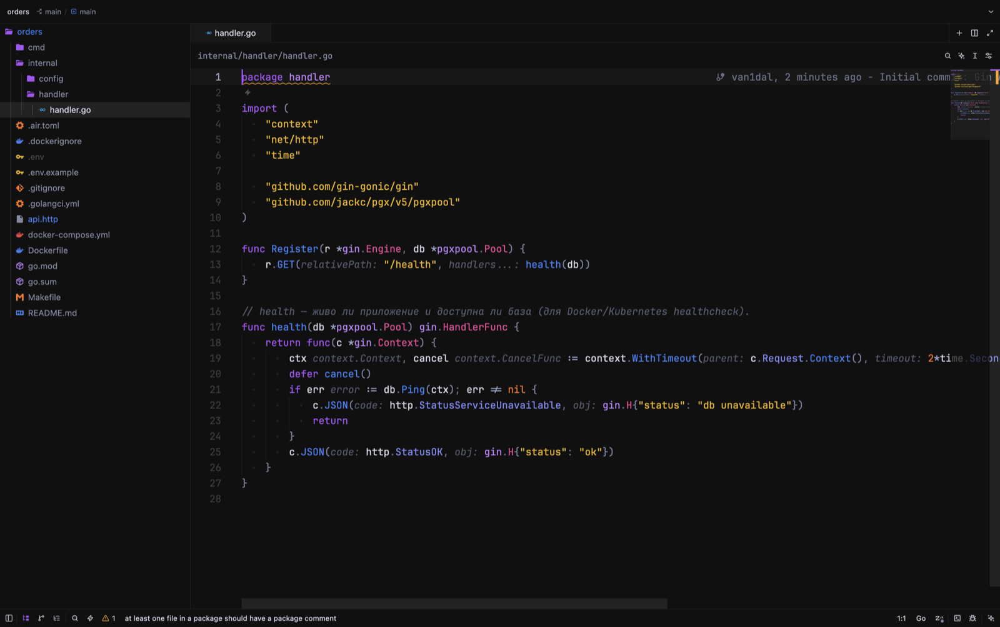

<div align="center">

# dotfiles

My macOS setup for Go and Docker work: dark, fast, and easy on memory.<br>
MacBook Air M2 · 8 GB · zsh · Ghostty · AeroSpace · Zed


<sub>25 live wallpapers — all drawn in Swift and changing throughout the day</sub>

</div>

---

## Why

I have 8 GB of RAM and still run Docker, Go and a couple of editors at the same time. So everything
here is built around two goals: **nothing should lag**, and **it should look good**.

A few things that came out of that:

- **Docker runs on OrbStack**, not Docker Desktop. Memory is taken when needed and given back, instead of a VM sitting on 4 GB all day.
- **The prompt is plain zsh**, no starship. Outside a git repo it spawns zero processes; inside, a single `git status`. The shell starts in ~0.15 s.
- **Zed instead of VS Code** for everyday code — usually a fraction of the memory.
- **Wallpapers don't run in the background** — they're regular dynamic HEIC files, macOS switches the frames itself.

> Comments in the configs and messages printed by the commands are in Russian — that's my native language.

<p align="center"></p>

## Install

You'll need [Homebrew](https://brew.sh) and [oh-my-zsh](https://ohmyz.sh).

```bash
git clone https://github.com/van1dalgrr-arch/dotfiles ~/dotfiles
cd ~/dotfiles
brew bundle          # everything from the Brewfile
./install.sh         # symlinks + theme + wallpaper
```

`install.sh` doesn't delete anything: if a config already exists, it's renamed to `*.bak`.
After that you edit configs right in `~/dotfiles`, and changes show up in `git status`.

Then run `dot doctor` — it checks symlinks, installed tools, font, theme, git hooks and shell startup time,
and tells you how to fix anything that's off. `dot` also wraps the rest: `dot install`, `dot update`, `dot theme`, `dot wall`, `dot check`.

To undo everything: `./uninstall.sh` shows the plan, `./uninstall.sh --yes` removes the symlinks and restores your `*.bak` files.

`macos.sh` is separate and optional: fast key repeat, no autocorrect, screenshots in `~/Pictures/Screenshots`.

## What's inside

| | |
|---|---|
| **Terminal** | [Ghostty](https://ghostty.org) with a drop-down window on `` ctrl+` `` and a glowing cursor trail |
| **Windows** | [AeroSpace](https://github.com/nikitabobko/AeroSpace) — i3-style tiling, hotkeys work on any keyboard layout |
| **Prompt** | custom zsh: path from the repo root, git status, Go version from `go.mod`, command duration |
| **Editor** | [Zed](https://zed.dev) with my own Dev Night theme and icons, Delve debugger, golangci-lint in the editor, tasks on `ctrl-r` |
| **Themes** | `theme vesper` / `kanagawa` / `rose-pine` — recolors the whole terminal, app icons and wallpaper |
| **Wallpapers** | `wall` — pick one of 25 live wallpapers with an image preview right in the terminal |
| **Git** | delta for diffs, lazygit, gitleaks before every commit |
| **Docker** | OrbStack, lazydocker, and `up` — start dependencies and run the project in one command |
| **API & DB** | [Yaak](https://yaak.app) instead of Postman (light, Tauri), [TablePlus](https://tableplus.com) for databases, `pgcli` via `db` |

<p align="center"></p>

## Day to day

Forgot a command? Press `?` (or `ctrl+/`) — a cheatsheet with every hotkey, function and alias pops up.

| Command | What it does |
|---|---|
| `p` | jump to a project in `~/dev` (fzf with a preview and recent commits) |
| `up` | start only the dependencies from compose (postgres, redis…) and run the app with `.env` |
| `pl` | all projects at once: stack, branch, uncommitted changes, last commit age |
| `gonew myapi` | new Gin project with air and git |
| `got` / `gotw` | run tests with gotestsum / rerun them on every save |
| `ram` | what's eating memory — grouped by app, not by process |
| `dsh` / `dlogs` | shell into a container / follow its logs (picked with fzf) |
| `gco` | switch branches with fzf |
| `killport 8080` | free a port |
| `update` | weekly maintenance: brew, Go tools, Docker junk, tldr, re-apply icons |
| `db` | pgcli into the project database (from `DATABASE_URL` / `.env`) |
| `vuln` | vulnerabilities: govulncheck for Go deps + trivy for the rest |
| `load` | load test an endpoint with oha (`/health` by default) |
| `theme` | switch the terminal theme |
| `wall` | switch the wallpaper |

Type a command that doesn't exist and the prompt tells you if it's available in brew — like `pkgfile` on Arch.

## Wallpapers

```bash
wall             # list with an image preview, enter to apply
wall eclipse     # apply directly
```

Space — `eclipse` `orbit` `rings` `aurora` `horizon` `startrails`<br>
Tech — `code` `circuit` `ridges` `minimal` `halftone` `iso` `helix` `topo`<br>
Everything else — `petals` `prism` `ocean` `glass` `crystal` `vinyl` `neon` `rain` `bauhaus` `mesh` `kanagawa`

**[See all 25 in the gallery →](docs/wallpapers.md)**

Each wallpaper is a short Swift script in `icons/`. It renders 12 frames per day, and every parameter
(color, light, positions) is computed continuously from the hour, so macOS blends smoothly from one
frame to the next. Wallpapers are applied to all Spaces at once.

Want your own? Create `icons/wallpaper-<name>.swift`:

```swift
runWallpaper { hour in
    let ctx = canvas()                     // near-black canvas
    let (a, b) = tint(hour)                // colors for this time of day
    radialGlow(ctx, CGPoint(x: W / 2, y: H / 2), 400 * S, a, 0.3)
    return bloom(ctx.makeImage()!)
}
```

The palette, stars, glow and HEIC builder live in `icons/wallpaper-kit.swift`. Then run `wall <name>`.

## Docs

| | |
|---|---|
| [Wallpapers](docs/wallpapers.md) | all 25 live wallpapers with previews, and how to make your own |
| [Themes](docs/themes.md) | how `theme` recolors everything from one palette file |
| [Hotkeys](docs/hotkeys.md) | AeroSpace, Ghostty and Zed shortcuts |
| [Troubleshooting](docs/troubleshooting.md) | icons reset, theme not applied, drop-down terminal, starship |
| [Changelog](CHANGELOG.md) | what changed between releases |

## Leak protection

Before **every** commit in any repo, [gitleaks](https://github.com/gitleaks/gitleaks) scans what's
being committed. A password, token or key in there — the commit is blocked and you see the file and line.
A global `.gitignore` keeps `.env`, keys and `.DS_Store` out of every repo.

Per-project hooks still run — `git/hooks/_chain` calls them after the check.
False positive? Add a `gitleaks:allow` comment on the line, or use `git commit --no-verify`.

## Layout

```
dotfiles/
├── zsh/            .zshrc, prompt, theme loader, cheatsheet, ram
├── themes/         theme palettes and apply.sh
├── icons/          wallpapers, app icons, ~/dev folder icon
├── ghostty/        config and the cursor trail shader
├── aerospace/      window tiling
├── zed/            settings, Dev Night theme, icon theme, tasks, snippets
├── git/            .gitconfig, delta, gitleaks hooks, global ignore
├── fastfetch/      Arch-logo greeting in new windows
├── vscode/         settings and extension list
├── btop/ bat/ eza/ lazygit/ atuin/ tealdeer/ starship/
├── Brewfile        everything installed via brew
├── install.sh      symlinks
└── macos.sh        system defaults (optional)
```

## Thanks

[Vesper](https://github.com/raunofreiberg/vesper) ·
[Rosé Pine](https://rosepinetheme.com) ·
[Kanagawa](https://github.com/rebelot/kanagawa.nvim) ·
[Nerd Fonts](https://www.nerdfonts.com) ·
[Ghostty](https://ghostty.org) ·
[AeroSpace](https://github.com/nikitabobko/AeroSpace) ·
[OrbStack](https://orbstack.dev)

## License

[MIT](LICENSE) — take whatever you like, copy it, make it yours.
