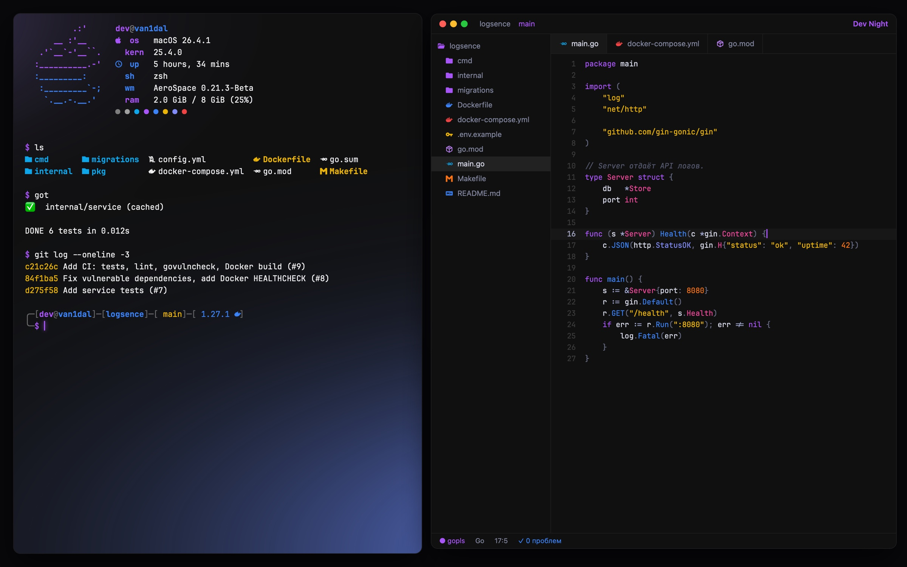
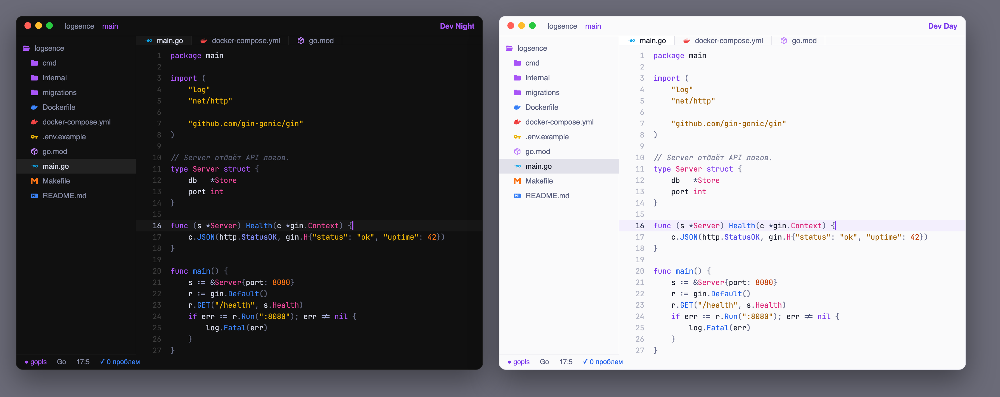
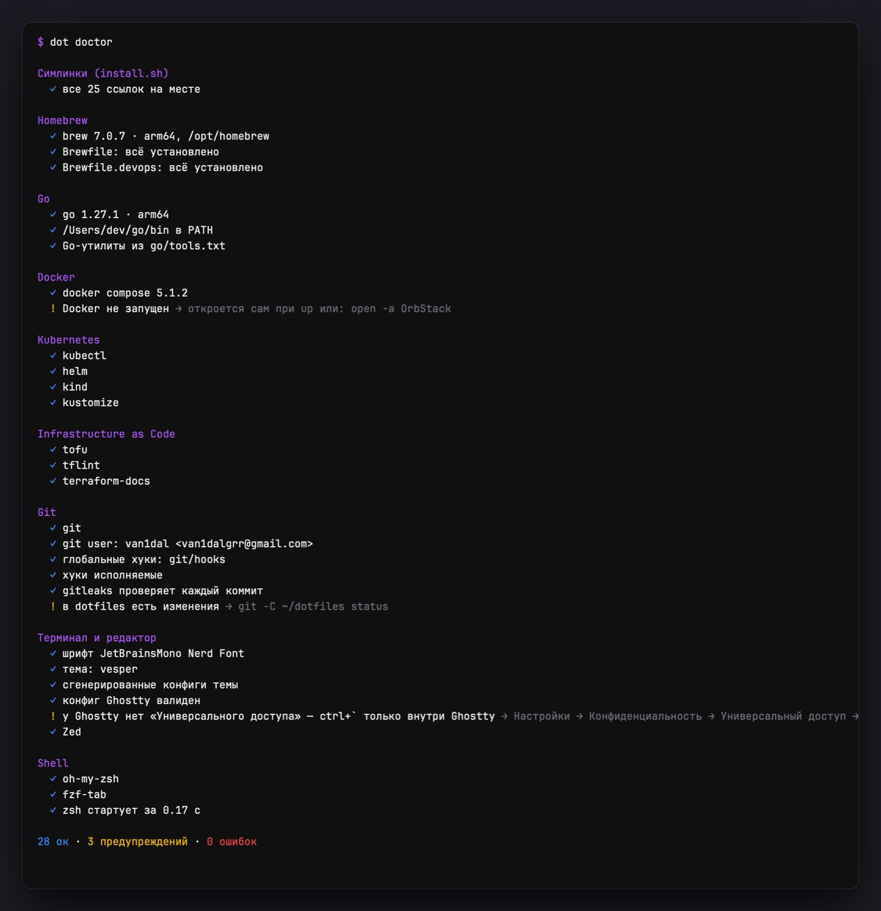
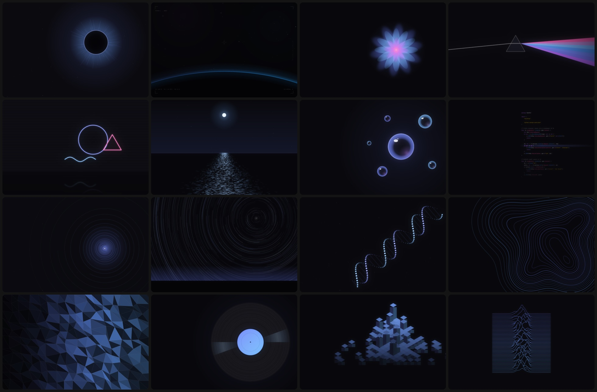
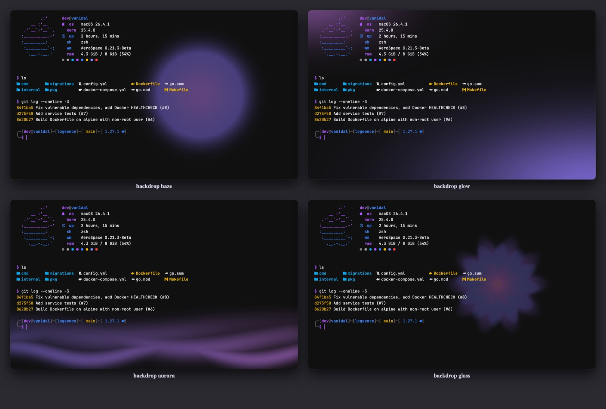

<div align="center">

# dotfiles

My macOS setup for Go and Docker work: dark, fast, and easy on memory.<br>
MacBook Air M2 · 8 GB · zsh · Ghostty · AeroSpace · Zed




<sub>Ghostty + Zed tiled by AeroSpace. The terminal's glow is built from the wallpaper's colors. Rendered from real command output.</sub>

**One command on a clean Mac:** `curl -fsSL https://raw.githubusercontent.com/van1dalgrr-arch/dotfiles/main/bootstrap.sh | bash`

</div>

---

## Why

I have 8 GB of RAM and still run Docker, Go and a couple of editors at the same time. So everything
here is built around two goals: **nothing should lag**, and **it should look good**.

A few things that came out of that:

- **Docker runs on OrbStack**, not Docker Desktop. Memory is taken when needed and given back, instead of a VM sitting on 4 GB all day.
- **The prompt is plain zsh**, no starship. Outside a git repo it spawns zero processes; inside, a single `git status`. The shell starts in ~0.15 s.
- **Zed instead of VS Code** for everyday code — usually a fraction of the memory.
- **Wallpapers don't run in the background** — they're regular dynamic HEIC files, macOS switches the frames itself.

> Comments in the configs and messages printed by the commands are in Russian — that's my native language.


## Install

On a clean Mac, one command:

```bash
curl -fsSL https://raw.githubusercontent.com/van1dalgrr-arch/dotfiles/main/bootstrap.sh | bash
```

It installs the Command Line Tools and Homebrew, clones this repo to `~/dotfiles` and runs `make install`.
Anything already there is skipped, so it's safe to run again. `bootstrap.sh --dry-run` shows the plan.
Then: `exec zsh`, `./macos.sh` (preview) → `./macos.sh --yes`, and `dot doctor`, where everything should be ✓.

The same by hand: `xcode-select --install` → [Homebrew](https://brew.sh) → `git clone … ~/dotfiles` → `make install`.

`./install.sh` is safe to run again. It:

- symlinks every config (a file already in place is kept as `*.bak`, nothing gets deleted)
- clones oh-my-zsh and fzf-tab at **pinned commits**, without the oh-my-zsh installer, which would overwrite `.zshrc`
- installs Go tools at **pinned versions** from `go/tools.txt`
- applies the theme and wallpaper

It doesn't install apps (that's `brew bundle`), and it doesn't touch macOS settings (that's `macos.sh`).

Optional extras: `make devops` (Kubernetes / IaC tools, see below) and `./macos.sh` (system settings).

**Uninstall:** `./uninstall.sh` prints the plan. `./uninstall.sh --yes` removes the symlinks and restores
your `*.bak` files, and `--purge` also deletes the generated theme files. Homebrew packages are left alone.

## What's inside

| | |
|---|---|
| **Terminal** | [Ghostty](https://ghostty.org) without a title bar (like in a tiling WM), a smooth gliding cursor like VS Code's, a drop-down window on `` ctrl+` `` from any app |
| **Windows** | [AeroSpace](https://github.com/nikitabobko/AeroSpace) — i3-style tiling, hotkeys work on any keyboard layout |
| **Prompt** | custom zsh in a frame: `╭─[user@host]─[path]─[git]─[Go · compose · ⎈ k8s context]`, command duration, collapses after Enter |
| **Editor** | [Zed](https://zed.dev) with my own themes, Dev Night (dark) and Dev Day (light), that switch with macOS, plus icons. Delve debugger, golangci-lint in the editor, tasks on `ctrl-r` |
| **Themes** | `theme vesper` / `kanagawa` / `rose-pine`: recolors the whole terminal, app icons and wallpaper. **Light mode** (Dev Day) follows macOS |
| **Effects** | `fx` — Ghostty shaders: smooth cursor, trail, sparks as you type, focus flash, neon glow; colored by the theme |
| **Backdrop** | `backdrop` — the wallpaper's light behind the terminal text: glow, aurora, haze or glass |
| **Wallpapers** | `wall`: 25 live wallpapers drawn in Swift that change through the day, plus your own photos (`wall add`), upscaled without blur |
| **Git** | delta for diffs, lazygit, gitleaks before every commit |
| **Docker** | OrbStack, lazydocker, and `up` — start dependencies and run the project in one command |
| **GoLand** | the same Dev Night / Dev Day themes as a JetBrains plugin and `.icls`, see [jetbrains/](jetbrains) |
| **API & DB** | [Yaak](https://yaak.app) instead of Postman (light, Tauri), [TablePlus](https://tableplus.com) for databases, `pgcli` via `db` |

<p align="center"></p>
<p align="center"><sub>Dev Night and Dev Day, rendered from the theme file by <code>zed/tools/preview.py</code></sub></p>

## Day to day

Forgot a command? Press `?` (or `ctrl+/`) — a cheatsheet with every hotkey, function and alias pops up.

| Command | What it does |
|---|---|
| `p` | jump to a project in `~/dev` (fzf with a preview and recent commits) |
| `up` | start only the dependencies from compose (postgres, redis…) and run the app with `.env` |
| `pl` | all projects at once: stack, branch, uncommitted changes, last commit age |
| `gonew myapi` | new Gin project with air and git |
| `got` / `gotw` | run tests with gotestsum / rerun them on every save |
| `ram` | what's eating memory — grouped by app, not by process |
| `dsh` / `dlogs` | shell into a container / follow its logs (picked with fzf) |
| `gco` | switch branches with fzf |
| `killport 8080` | free a port |
| `update` | weekly maintenance: brew, pinned Go tools, Docker junk, tldr, re-apply icons |
| `pd` | `dot project doctor`: what the current project has and what it's missing |
| `db` | pgcli into the project database (from `DATABASE_URL` / `.env`) |
| `vuln` | vulnerabilities: govulncheck for Go deps + trivy for the rest |
| `load` | load test an endpoint with oha (`/health` by default) |
| `theme` | switch the terminal theme |
| `wall` | switch the wallpaper |

Type a command that doesn't exist and the prompt tells you if it's available in brew — like `pkgfile` on Arch.

## Diagnostics: `dot doctor`

```bash
dot doctor           # ~1 s: symlinks, Brewfile, Go, Docker, Kubernetes, IaC, git hooks, Ghostty, Zed, shell
dot doctor --deep    # ~20 s: + versions, pinned revisions, packages outside the Brewfile, brew doctor, Zed JSONC, …
```

It only reads, never changes anything. `✓` ok · `!` worth a look · `✗` broken (exit code 1) · `○` optional and not installed.
Every problem line ends with the command that fixes it. Exit codes: `0` ok (warnings allowed), `1` errors, `2` bad usage.

<p align="center"></p>

## Project doctor

```bash
cd ~/dev/myapi && dot project doctor     # or: pd, or: dot project doctor ~/dev/myapi
```

It finds the nearest `go.mod` (from any subfolder) and runs a checklist, grouped by topic:

| Group | Checks |
|---|---|
| Go | `go.mod`, module, `go` / `toolchain` version vs the installed Go, `go.sum`, entry point |
| Tests | `*_test.go` count, gotestsum |
| Quality | golangci-lint (+ config), govulncheck |
| Build & run | Makefile targets, Dockerfile (+ `.dockerignore`, multi-stage), compose file, `.air.toml` |
| Database | migrations folder and `.sql` count, sqlc |
| Config & secrets | `.env.example`, **`.env` tracked or not ignored → ✗** |
| Git | branch, remote, uncommitted changes, `.gitignore`, CI |

Missing optional files show up as `○`, not as errors. It never runs migrations, starts containers, or touches the project.
Outside a Go project it runs only the generic checks.

## Updating

```bash
update               # (or dot update) brew upgrade, pinned Go tools, Docker junk, tldr, re-apply icons
dot doctor --deep    # anything installed outside the Brewfile? anything outdated?
```

Change a config: edit it in `~/dotfiles`, and the change shows up in `git status`. Add a tool: put it in the `Brewfile`,
then `brew bundle`.

## Versions

| What | How it's pinned |
|---|---|
| Homebrew packages | `Brewfile`. Homebrew only ships the latest version, so these are the newest at install time |
| Go itself | `brew "go"` for the global Go. **Per project, `go.mod` decides**: `go 1.N` / `toolchain go1.N.x` makes Go download that exact toolchain (`GOTOOLCHAIN=auto`, the default) |
| Go tools | `go/tools.txt`: exact versions; `dot tools` shows the status, `dot tools install` applies it |
| oh-my-zsh, fzf-tab | commit hashes at the top of `install.sh` |

**Why not mise / asdf?** For a Go-only setup they would duplicate what Go already does (the toolchain in `go.mod`)
and add a shell hook. If you install mise for other languages, `.zshrc` activates it automatically.
`dot doctor --deep` warns when mise manages Go too, since two `go` binaries in PATH are a classic source of confusion.

## DevOps toolchain

| | Tools |
|---|---|
| Always (`Brewfile`) | kubectl, helm, k9s, kubectx/kubens, stern, OrbStack (Docker + Compose + buildx), lazydocker, dive, hadolint, trivy, act |
| Optional (`make devops`) | **kind** (Kubernetes in Docker), **kustomize**, **opentofu** (`tofu`, alias `tf`), **terraform-docs**, **tflint** (built from source at a pinned version: Homebrew dropped the formula) |

All of them are small arm64 binaries that don't run in the background. Nothing creates clusters or cloud resources
on its own: `kind create cluster` and `tf apply` are always up to you.

## macOS settings

```bash
./macos.sh                     # show the plan: setting, current value → new value. Changes nothing
./macos.sh --yes               # apply
./macos.sh --yes finder dock   # only some groups
```

Groups: `apps` (code files open in Zed; macOS asks to confirm each type, so run it at the Mac), `login` (Raycast at login; AeroSpace starts itself and Ghostty), `keyboard` (fast repeat, no autocorrect or smart quotes), `trackpad` (tap to click), `finder` (extensions,
hidden files, path and status bar, list view, folders first, search the current folder, no `.DS_Store` on
network or USB drives), `saving` (to disk rather than iCloud, expanded dialogs), `screenshots`
(PNG in `~/Pictures/Screenshots`, no shadow or thumbnail), `dock` (autohide, no recents, Spaces stay in place for AeroSpace),
`appearance` (dark, `ctrl-cmd` drag windows).

Running it twice is safe: values that already match are skipped. It restarts only Finder, Dock or SystemUIServer,
and never logs you out. Keyboard, trackpad and dark mode apply after your next login.

## Wallpapers



```bash
wall             # list with an image preview, enter to apply
wall eclipse     # apply directly
```

Space — `eclipse` `orbit` `rings` `aurora` `horizon` `startrails`<br>
Tech — `code` `circuit` `ridges` `minimal` `halftone` `iso` `helix` `topo`<br>
Everything else — `petals` `prism` `ocean` `glass` `crystal` `vinyl` `neon` `rain` `bauhaus` `mesh` `kanagawa`

**[See all 25 in the gallery →](docs/wallpapers.md)**

**Your own photos** work too: `wall add ~/Downloads/photo.jpg sakura`. Small or compressed photos are cleaned of
JPEG artifacts, upscaled to the screen in two Lanczos steps, cropped to its aspect and lightly sharpened
(`icons/photo-wallpaper.swift`), then show up in the `wall` list. Photos stay in `wallpapers/photos/`, which is
git-ignored: they live next to the config but never reach the public repo.

Each wallpaper is a short Swift script in `icons/`. It renders 12 frames per day, and every parameter
(color, light, positions) is computed continuously from the hour, so macOS blends smoothly from one
frame to the next. Wallpapers are applied to all Spaces at once.

Want your own? Create `icons/wallpaper-<name>.swift`:

```swift
runWallpaper { hour in
    let ctx = canvas()                     // near-black canvas
    let (a, b) = tint(hour)                // colors for this time of day
    radialGlow(ctx, CGPoint(x: W / 2, y: H / 2), 400 * S, a, 0.3)
    return bloom(ctx.makeImage()!)
}
```

The palette, stars, glow and HEIC builder live in `icons/wallpaper-kit.swift`. Then run `wall <name>`.

## Terminal backdrop

```bash
backdrop          # pick a style with a preview
backdrop glow     # apply directly · backdrop off — no background
```



The backdrop is made from your **current wallpaper**: only its colored light is kept and the dark parts
become transparent, so it works on the dark theme and on light Dev Day alike. **glow** is light from the corners,
**aurora** is waves along the bottom edge, **haze** is the wallpaper's light softly blurred, and **glass** shows the wallpaper itself, faint and vignetted.
`wall` rebuilds the backdrop for the new wallpaper, and Ghostty reloads by itself (over AppleScript), no `cmd+shift+,` needed.
The generator is `icons/backdrop.swift` (Core Image, no extra tools).

## Docs

| | |
|---|---|
| [How to use it (RU)](docs/guide.ru.md) | every command and feature, day to day: themes, wallpapers, backdrop, prompt, git, Go, Docker, Mac upkeep |
| [How it works (RU)](docs/how-it-works.ru.md) | architecture, diagrams, the "why" behind every piece, and recipes |
| [Recovery (RU)](docs/recovery.ru.md) | the Mac was wiped: restore checklist, what comes back by itself, what doesn't |
| [Wallpapers](docs/wallpapers.md) | all 25 live wallpapers with previews, and how to make your own |
| [Themes](docs/themes.md) | all themes side by side, and how `theme` recolors everything from one palette file |
| [GoLand / JetBrains](jetbrains/README.md) | Dev Night and Dev Day as editor color schemes (`.icls`), one-click import |
| [Hotkeys](docs/hotkeys.md) | AeroSpace, Ghostty and Zed shortcuts |
| [Troubleshooting](docs/troubleshooting.md) | icons, theme, drop-down terminal, doctor statuses, Go versions, `macos.sh`, aliases |
| [Changelog](CHANGELOG.md) | what changed between releases |

## Leak protection

Before **every** commit in any repo, [gitleaks](https://github.com/gitleaks/gitleaks) scans what's
being committed. A password, token or key in there — the commit is blocked and you see the file and line.
A global `.gitignore` keeps `.env`, keys and `.DS_Store` out of every repo.

Per-project hooks still run — `git/hooks/_chain` calls them after the check.
False positive? Add a `gitleaks:allow` comment on the line, or use `git commit --no-verify`.

## Layout

Every folder has its own `README.md` (English) and `README.ru.md` (Russian): what's inside, where it's linked, how to change it.

```
dotfiles/
├── bin/dot          entry point: doctor, project doctor, tools, install, update, theme, wall
├── lib/             dot modules: ui, doctor, project, tools (bash 3.2, no dependencies)
├── zsh/             .zshrc, prompt, theme loader, cheatsheet, ram, update, gonew, backend
├── themes/          theme palettes and apply.sh
├── icons/           wallpapers, app icons, folder icons (Swift)
├── ghostty/  aerospace/  zed/  vscode/  fastfetch/
├── git/             .gitconfig, delta, gitleaks hooks, global ignore
├── go/              tools.txt / tools.devops.txt: pinned Go tools
├── tests/smoke.sh   smoke tests for dot (make test, CI)
├── btop/ bat/ eza/ lazygit/ atuin/ tealdeer/ starship/ pgcli/
├── Brewfile         required apps and CLIs   ·  Brewfile.devops: optional
├── bootstrap.sh     clean Mac → everything, one curl command
├── install.sh       symlinks, pinned clones and Go tools, theme   ·  uninstall.sh
└── macos.sh         system settings (prints a plan, applies only with --yes)
```

How it fits together: `brew bundle` installs programs. `install.sh` links the configs from here into `~` and
`~/.config`. `themes/apply.sh` generates the colored copies. `dot` checks all of it.

## Thanks

[Vesper](https://github.com/raunofreiberg/vesper) ·
[Rosé Pine](https://rosepinetheme.com) ·
[Kanagawa](https://github.com/rebelot/kanagawa.nvim) ·
[Nerd Fonts](https://www.nerdfonts.com) ·
[Ghostty](https://ghostty.org) ·
[AeroSpace](https://github.com/nikitabobko/AeroSpace) ·
[OrbStack](https://orbstack.dev)

## License

[MIT](LICENSE) — take whatever you like, copy it, make it yours.
