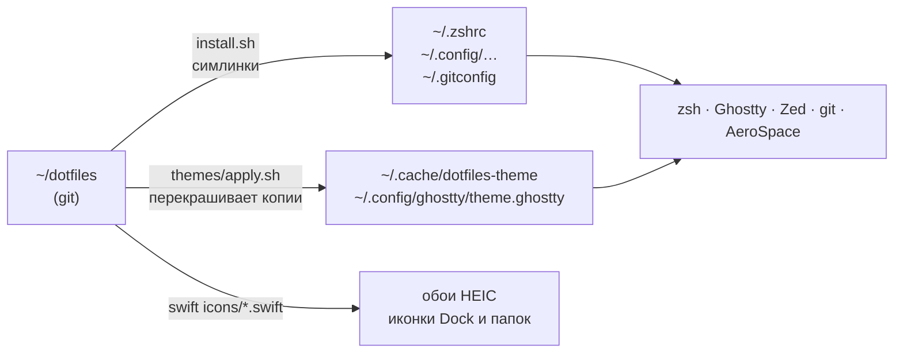
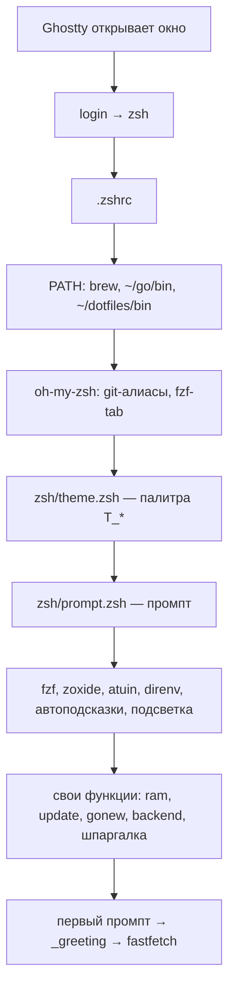
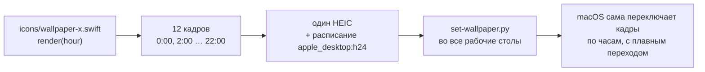

# Как это устроено

Документ для себя: что где лежит, как одно цепляется за другое и **почему сделано именно так**.
Если что-то сломалось или хочется поменять — начинай отсюда, потом `dot doctor`.

---

## 1. Общая картина

Репозиторий — это исходники. Система читает конфиги из своих обычных мест (`~/.zshrc`, `~/.config/…`),
а там лежат **симлинки** на файлы из `~/dotfiles`. Правишь файл в репозитории — изменение сразу «в системе»
и сразу видно в `git status`.



Три вида файлов:

| Что | Где | Можно править руками? |
|---|---|---|
| исходники | `~/dotfiles/**` | да — это и есть «настройки» |
| симлинки | `~/.zshrc`, `~/.config/zed/settings.json`, … | нет смысла — это ссылки на репозиторий |
| сгенерированное темой | `~/.cache/dotfiles-theme/*`, `~/.config/ghostty/theme.ghostty` | нет — перезапишется при `theme` |

## 2. Установка: `install.sh`

Каждая строка `link <файл в репо> <куда в системе>` делает одно: если на месте уже лежит **обычный файл** —
переименовывает его в `*.bak` (ничего не теряется), потом ставит симлинк. Потом клонирует oh-my-zsh и fzf-tab
на закреплённых коммитах (`OMZ_REV`, `FZF_TAB_REV` вверху файла), ставит Go-утилиты точных версий из `go/tools.txt`
(`dot tools install`) и в конце запускает `themes/apply.sh`. Повторный запуск безопасен.

Почему симлинки, а не копирование: копии расходятся. Через месяц уже не помнишь, какая версия настоящая.
Симлинк — один источник правды, и git видит каждое изменение.

Откат — `./uninstall.sh` (сначала показывает план) → `./uninstall.sh --yes`: убирает ссылки, возвращает `*.bak`.

## 3. zsh: что происходит при открытии терминала



Файлы в `zsh/`:

| Файл | Что внутри |
|---|---|
| `.zshrc` | порядок загрузки, алиасы, `p`, `up`, `pl`, подсветка ввода |
| `theme.zsh` | читает текущую тему, задаёт `T_ROSE`, `T_FOAM`… и переменные для bat/eza/lazygit; команды `theme` и `wall` |
| `prompt.zsh` | промпт, сворачивание старых промптов, «команда не найдена» |
| `cheatsheet.zsh` | `?` / `ctrl+/` |
| `ram.zsh`, `update.zsh`, `gonew.zsh`, `backend.zsh` | одноимённые команды |

Старт — ~0.15 с. Проверить: `dot doctor`, раздел Shell. Если стало медленно — что-то тяжёлое добавилось в `.zshrc`.

## 4. Промпт без starship

У zsh есть хуки: `preexec` — прямо перед запуском команды, `precmd` — прямо перед показом промпта.

- `preexec` запоминает время старта команды.
- `precmd` считает, сколько шла команда, смотрит код выхода и собирает строку промпта.
- Git: сначала **без запуска программ** ищем папку `.git`, поднимаясь вверх по пути. Нет — git вообще не вызывается.
  Есть — один `git status --porcelain=v2 --branch`, из него берём ветку, `+ ! ?`, `⇡⇣`, stash.
- Версия Go — читаем строчку `go 1.x` из `go.mod` встроенными средствами zsh, без `go version`.

Почему не starship: starship — отдельная программа, которая запускается **на каждый Enter**.
Свой промпт делает то же самое внутри уже запущенного zsh.

«Сворачивание» (transient prompt): хук `line-finish` срабатывает, когда ты нажал Enter, и заменяет
двухстрочный промпт на короткий `$ команда`. История остаётся чистой.

Вид — рамка как в Linux-райсах: `╭─[dev@van1dal]─[путь]─[ ветка]─[ 1.27 󰡨 ⎈ контекст]`, ниже `╰─$`.
Каждый сегмент `─[…]` рисуется, только если в нём что-то есть. `⎈` — контекст kubectl: читается
из `~/.kube/config` (без запуска kubectl) и показывается, только когда важен — в проекте с `k8s/`,
`Chart.yaml`, `kustomization.yaml` или после команды `kubectl`/`k`/`helm`/`k9s` в этом окне.

## 5. Приветствие (fastfetch)

`_greeting` повешен на `precmd` и сам себя снимает после первого раза — то есть показывается **один раз**,
перед первым промптом окна, когда размер окна уже известен.

Условия: это Ghostty, окно не меньше 60×12, и в окружении **нет** `DOTFILES_GREETED`. После показа
переменная экспортируется — поэтому вложенный `zsh` внутри окна приветствие уже не показывает, а новое окно — показывает
(у него свежее окружение от Ghostty).

**История бага.** Сначала проверялось `SHLVL` (уровень вложенности оболочки). Но Ghostty запускает AeroSpace,
и `SHLVL` наследуется: в любом окне он был 3+, проверка «≤ 2» не проходила никогда. Нашёл, только когда записал
переменные из настоящего окна в файл. Мораль: проверять в реальном окружении, а не в эмуляции.

Память в приветствии считается через `memory_pressure` — как в `ram` и в Мониторе системы. Встроенный модуль fastfetch
считал кэш файлов «занятым» и показывал 86% при реальных ~45%.

## 6. Темы

Все конфиги в репозитории написаны **цветами Rosé Pine**. Тема — файл `themes/<имя>.sh` с теми же 19 ролями:

```
T_BASE  T_SURFACE  T_OVERLAY   — фоны
T_MUTED T_SUBTLE   T_TEXT      — текст
T_LOVE  T_GOLD  T_ROSE  T_PINE  T_FOAM  T_IRIS   — акценты
T_DIFF_*                       — цвета diff
```

`themes/apply.sh <имя>` строит таблицу «цвет Rosé Pine → цвет темы» и **одним проходом** perl
перекрашивает копии конфигов (Ghostty, starship, eza, lazygit, btop, bat, delta, шейдер курсора, Swift-скрипты иконок).
Один проход важен: если менять цвета по очереди, цвет A→B, а потом B→C превратит A в C.

Репозиторий при смене темы **не меняется** — пишутся только копии в `~/.config` и `~/.cache`.

Своя тема: скопируй `themes/vesper.sh`, поменяй hex, `theme <новое имя>`.
Цвета, которые раздражают (у тебя — мятный), правятся там же; ANSI-палитру Ghostty переопределяет `THEME_GHOSTTY_EXTRA`.

## 7. Живые обои



- Каждые обои — Swift-скрипт, который рисует кадр **для любого часа**. Цвета берутся из `tint(hour)` и `daylight(hour)`
  в `icons/wallpaper-kit.swift`, поэтому соседние кадры похожи и переход плавный.
- В HEIC в метаданные кладётся расписание «кадр № → время суток». Это тот же механизм, что у встроенных динамических обоев Apple.
  Фоновых программ нет — кадры переключает сама macOS.
- `set-wallpaper.py` пишет в базу обоев macOS напрямую: AppleScript менял обои только на **текущем** рабочем столе.
- `wall` собирает HEIC один раз (`~/Pictures/Wallpapers/<имя>.heic`) и пересобирает, только если скрипт изменился.

Грабли, на которые наступил: фильтр шума `CIRandomGenerator` (против «ступенек» на градиентах) сыпал тысячи белых точек —
убран. `pow()` от отрицательного синуса за краем экрана давал NaN, и линия не рисовалась целиком.

## 8. Иконки приложений и папок

`icons/icons.swift` и `icons/folder.swift` рисуют иконку 1024×1024 и ставят её через `NSWorkspace.setIcon` —
это то же самое, что вставить картинку в «Свойства» файла в Finder.

macOS **сбрасывает** такую иконку при обновлении приложения — поэтому её возвращает `update` (и `theme`).
Приложения, установленные от root (VS Code, Telegram, Happ), требуют `sudo`.

## 9. Git: защита от утечек

В `git/.gitconfig` задан `core.hooksPath = ~/dotfiles/git/hooks` — **глобальные** хуки для всех репозиториев.

- `pre-commit` запускает `gitleaks` на том, что коммитится. Нашёл ключ/токен/пароль — коммит отменяется, показывает файл и строку.
- Глобальные хуки отключают хуки самого проекта (`.git/hooks`). Поэтому все остальные хуки — ссылки на `_chain`,
  который вызывает хук проекта с тем же именем. Командные проекты (`kinoza-back`) не ломаются.
- `git/ignore` — глобальный `.gitignore`: `.env`, ключи, `.DS_Store` не попадут никуда.
- Цвета `git diff` (delta) лежат в `git/delta.gitconfig` и перекрашиваются темой через `[include]`.

## 10. Docker, `up`, `gonew`

Docker — через **OrbStack**: та же команда `docker`, но память берётся по требованию и отдаётся обратно.

`up` в папке проекта:
1. будит OrbStack, если спит;
2. из `docker-compose.yml` поднимает только сервисы **без `build:`** — то есть зависимости (postgres, redis), и ждёт их healthcheck;
3. запускает само приложение локально (`air` → `go run ./cmd/api` → `go run .`), подхватив `.env`.

Приложение крутится локально, а не в контейнере, — так работает hot reload и отладчик.

`gonew myapi` создаёт проект по шаблону из `zsh/gonew.zsh`: `cmd/api`, `internal/config`, `internal/handler`,
pgx, `/health` с пингом базы, graceful shutdown, compose, двухэтапный Dockerfile (итоговый образ ~15 МБ), Makefile, air, golangci-lint.

## 11. Zed

| Файл | Зачем |
|---|---|
| `zed/settings.json` | всё поведение: шрифты, автосохранение, gopls, golangci-lint, терминал, git |
| `zed/keymap.json` | свои хоткеи поверх раскладки JetBrains |
| `zed/tasks.json` | `ctrl-r`: up, air, тесты, тест под курсором, покрытие, compose, curl |
| `zed/debug.json` | `f5`: отладка через Delve — `cmd/api`, пакет, тест под курсором |
| `zed/snippets/go.json` | `iferr`, `ginh`, `htest`, … |
| `zed/dev-night-theme/`, `zed/dev-night-icons/` | два расширения Zed: темы Dev Night + Dev Day и иконки (как в каталоге Zed) |
| `zed/tools/light.py`, `preview.py` | собрать Dev Day из Dev Night; картинка-превью обеих тем |
| `zed/tools/build-icons.swift` | иконки: вытаскивает значки из Nerd Font в SVG |

Тема иконок — это **dev-расширение**: `install.sh` кладёт ссылку на папку в
`~/Library/Application Support/Zed/extensions/installed/`, и Zed считает её установленным расширением.
После правки темы Zed нужно перезапустить.

## 12. Проверки: `dot doctor`, `make check`, CI

- `dot doctor` — твоя машина: симлинки, Brewfile (обязательное ✗) и Brewfile.devops (необязательное ○), Go,
  Docker/Compose, Kubernetes, IaC, git-хуки, Ghostty, Zed, скорость zsh. Каждая проблема — с подсказкой.
  `dot doctor --deep` — ещё версии, закреплённые ревизии, лишние пакеты вне Brewfile, `brew doctor`. Только читает.
- `dot project doctor` (`pd`) — текущий Go-проект: go.mod, тесты, линтеры, Docker, миграции, безопасность `.env`.
- Код `dot` — в `lib/*.sh` (ui, doctor, project, tools), совместим с системным bash 3.2.
- `make check` — сам репозиторий: shellcheck, `bash -n` системным bash, синтаксис zsh, Brewfile, JSON, gitleaks.
  `make test` — смоук-тесты `tests/smoke.sh`. То же самое гоняет CI.
- CI на GitHub (`.github/workflows/ci.yml`): Linux — линтеры и gitleaks; **macOS** — компилирует все Swift-генераторы
  и применяет каждую тему в пустом `HOME`, как на новом маке.

## 13. Рецепты

| Хочу | Делаю |
|---|---|
| новую команду в терминал | функция в `zsh/*.zsh` + строка в `zsh/cheatsheet.zsh` (`имя\|описание`) |
| поменять цвет в теме | hex в `themes/<тема>.sh` → `theme <тема>` |
| новые обои | `icons/wallpaper-<имя>.swift` с `runWallpaper { hour in … }` → `wall <имя>` |
| новую программу | строка в `Brewfile` (или `Brewfile.devops`, если необязательная) → `dot install` |
| новую Go-утилиту / обновить её | `пакет@версия` в `go/tools.txt` → `dot tools install` |
| настройки macOS | `./macos.sh` (план) → `./macos.sh --yes` |
| новый конфиг под git | файл в репозиторий + строка `link` в `install.sh` → `./install.sh` |
| понять, что сломалось | `dot doctor` |
| всё обновить | `update` (раз в неделю) |
| откатить всё | `./uninstall.sh --yes` |
