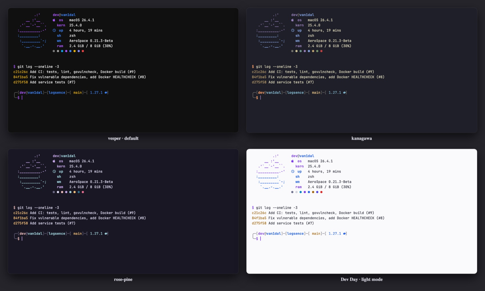

# Themes



<sub>vesper (default), kanagawa, rose-pine, and Dev Day, which switches on with macOS light mode. Rendered from each theme's real palette and prompt colors.</sub>


```bash
theme            # pick in fzf, palette preview on the right
theme vesper     # apply directly
```

| Theme | Mood |
|---|---|
| `vesper` | near-black with saturated violet and blue — the main one |
| `kanagawa` | indigo and paper, inspired by Hokusai |
| `rose-pine` | soft and muted |

How it works: every config in the repo is written in Rosé Pine colors, and a theme is just a map
of "which color becomes which" across 19 roles (`themes/<name>.sh`). `themes/apply.sh` recolors copies
of the configs into `~/.config` and `~/.cache` in a single pass — the repo itself never changes when you switch.
It recolors Ghostty, the prompt, syntax highlighting, fzf, bat, delta, eza, lazygit, btop,
Dock and folder icons, and the wallpaper. VS Code keeps its own theme.

## Light mode (Dev Day)

When macOS switches to light appearance, everything follows. **Ghostty** changes instantly:
`apply.sh` writes two Ghostty themes, `dotfiles-dark` (your theme) and `dotfiles-light`, and sets
`theme = light:dotfiles-light,dark:dotfiles-dark`. **Zed** switches to Dev Day too.

**zsh** (prompt, syntax highlighting, fzf, eza, bat, lazygit, delta) picks the light palette
`themes/light/day.sh` when a shell **starts**. Windows that were already open keep their colors until `exec zsh`.

To pin one look regardless of macOS, put `export DOTFILES_APPEARANCE=dark` (or `light`) in `~/.zshenv`.
The light palette is shared by every theme: change the colors in `themes/light/day.sh`, then run `theme`.
