# Wallpapers

Every wallpaper is a short Swift script in [`icons/`](../icons) that renders a dynamic HEIC —
frames change with the time of day and macOS blends between them. Apply one with `wall <name>`,
or run `wall` to pick from a list with image previews.

Previews show the 13:00 frame.

## Atmosphere

Moody, photo-like scenes: fog, dusk, snow. Painted in code at screen resolution, with depth of field and film grain.
Previews show the hour that suits each scene best. `backdrop <name>` puts a dark, readable version behind the terminal.

<table>
<tr><td width="33%" valign="top"><br><b><code>mistcity</code></b><br><sub>Panel high-rises sinking into blue fog, wires, a fence and warm windows that light up floor by floor at night</sub></td><td width="33%" valign="top"><br><b><code>hanami</code></b><br><sub>Cherry blossom at dusk over a bridge and dark water; a lamp comes on at night</sub></td><td width="33%" valign="top"><br><b><code>snowfall</code></b><br><sub>A courtyard in a snowstorm: tall blocks in the haze, snow-laden branches, flakes in three depths</sub></td></tr>
<tr><td width="33%" valign="top"><br><b><code>cosmea</code></b><br><sub>A field of pink cosmos fading into thick fog, a few tall stems in focus</sub></td><td width="33%" valign="top"><br><b><code>steppe</code></b><br><sub>Tall grass bent by the wind, the hill dissolving into mist</sub></td></tr>
</table>

## Space

<table>
<tr><td width="33%" valign="top">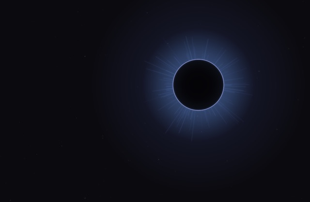<br><b><code>eclipse</code></b><br><sub>Black sun with a glowing corona; a diamond ring flares at sunrise and sunset</sub></td><td width="33%" valign="top">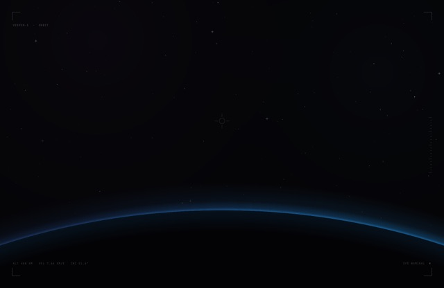<br><b><code>orbit</code></b><br><sub>Cockpit view: planet limb, glowing atmosphere, orbital sunrise, faint HUD</sub></td><td width="33%" valign="top">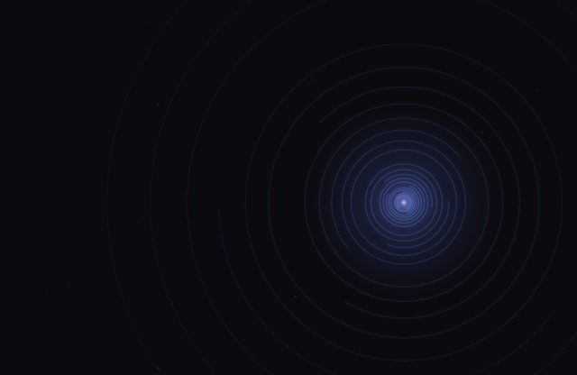<br><b><code>rings</code></b><br><sub>Thin concentric rings like a radar; arcs rotate through the day</sub></td></tr>
<tr><td width="33%" valign="top">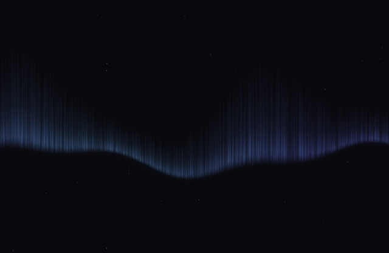<br><b><code>aurora</code></b><br><sub>Northern lights hanging in the night sky, brighter at night</sub></td><td width="33%" valign="top">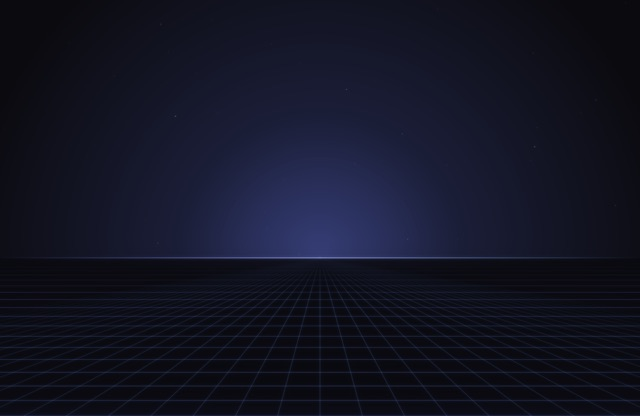<br><b><code>horizon</code></b><br><sub>Grid floor running to a glowing horizon</sub></td><td width="33%" valign="top">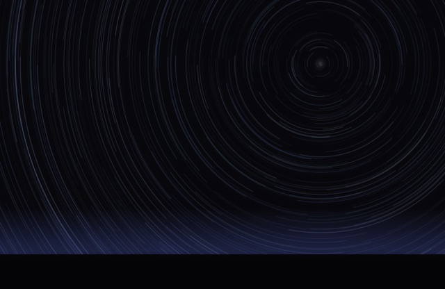<br><b><code>startrails</code></b><br><sub>Long-exposure star trails around the pole, longer at night</sub></td></tr>
</table>

## Tech

<table>
<tr><td width="33%" valign="top">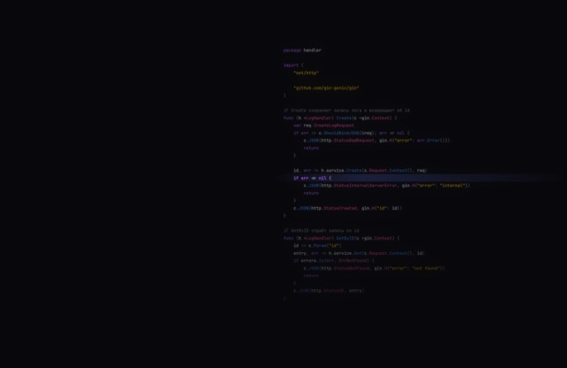<br><b><code>code</code></b><br><sub>Dimmed Go/Gin code with syntax colors and a glowing cursor line that moves down over the day</sub></td><td width="33%" valign="top"><br><b><code>circuit</code></b><br><sub>Circuit board traces with light pulses travelling along them</sub></td><td width="33%" valign="top">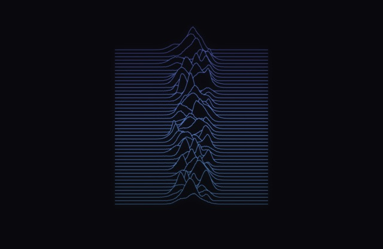<br><b><code>ridges</code></b><br><sub>Stacked peak lines, Unknown Pleasures style</sub></td></tr>
<tr><td width="33%" valign="top">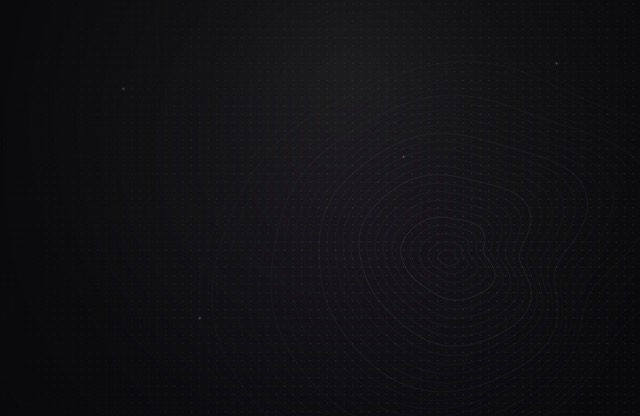<br><b><code>minimal</code></b><br><sub>Dot grid, topographic contours and one soft light</sub></td><td width="33%" valign="top">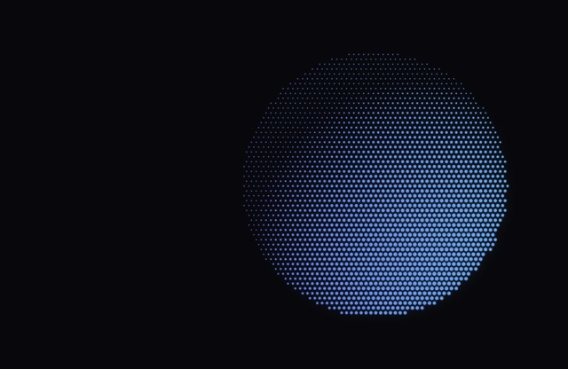<br><b><code>halftone</code></b><br><sub>A sphere drawn with dots; the light circles it over the day</sub></td><td width="33%" valign="top">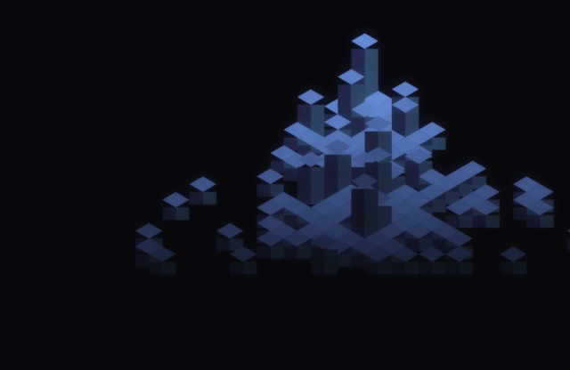<br><b><code>iso</code></b><br><sub>An isometric city of glowing cubes</sub></td></tr>
<tr><td width="33%" valign="top"><br><b><code>helix</code></b><br><sub>A DNA double helix of glowing dots that turns over the day</sub></td><td width="33%" valign="top">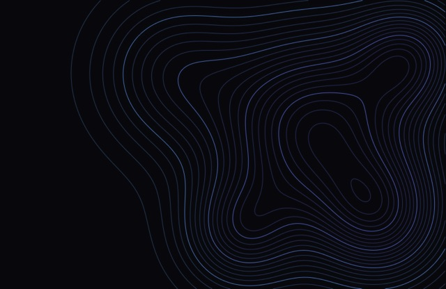<br><b><code>topo</code></b><br><sub>Topographic map, contour lines colored by height</sub></td></tr>
</table>

## Everything else

<table>
<tr><td width="33%" valign="top">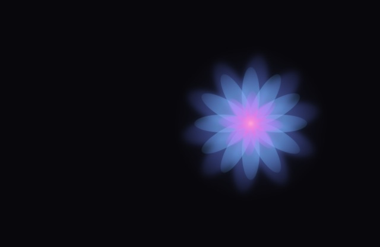<br><b><code>petals</code></b><br><sub>An abstract flower of translucent petals that slowly turns</sub></td><td width="33%" valign="top">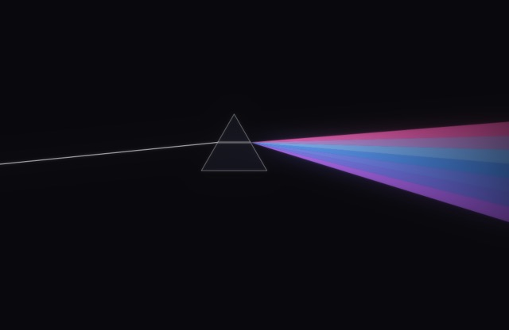<br><b><code>prism</code></b><br><sub>A beam enters a prism and splits into a violet-blue spectrum</sub></td><td width="33%" valign="top">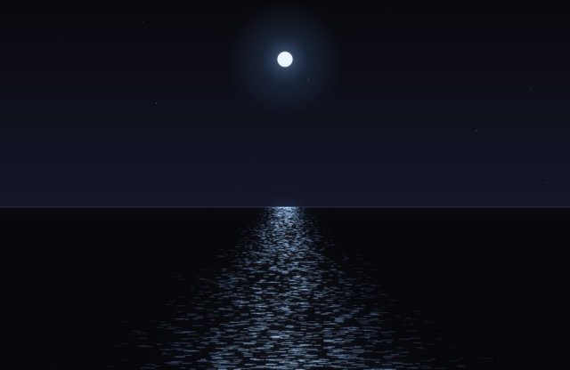<br><b><code>ocean</code></b><br><sub>Night sea with a moon path; the moon crosses the sky over the day</sub></td></tr>
<tr><td width="33%" valign="top"><br><b><code>glass</code></b><br><sub>Glass spheres with colored rims and highlights, slowly drifting</sub></td><td width="33%" valign="top">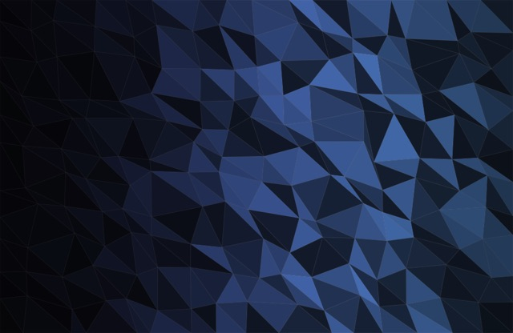<br><b><code>crystal</code></b><br><sub>Low-poly facets lit like a cut crystal</sub></td><td width="33%" valign="top">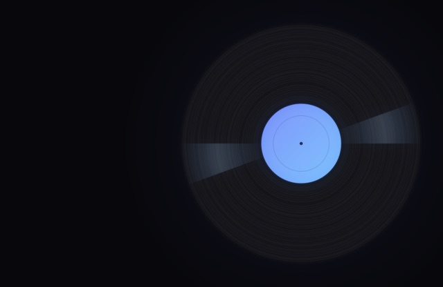<br><b><code>vinyl</code></b><br><sub>A vinyl record with grooves and a gradient label; turns over the day</sub></td></tr>
<tr><td width="33%" valign="top">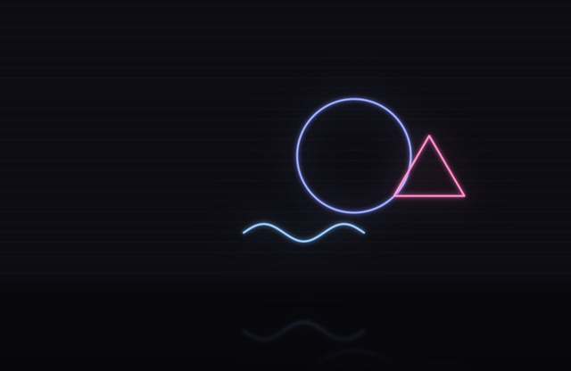<br><b><code>neon</code></b><br><sub>Neon shapes on a dark wall, reflected on the floor</sub></td><td width="33%" valign="top">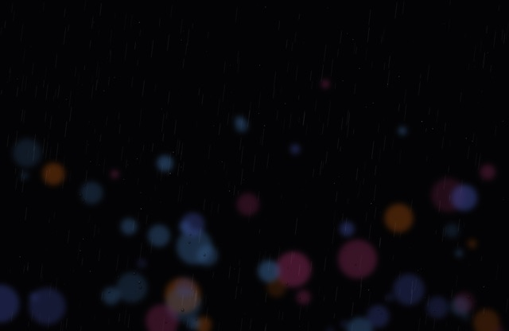<br><b><code>rain</code></b><br><sub>Night city through a wet window: bokeh lights, drops and streaks</sub></td><td width="33%" valign="top">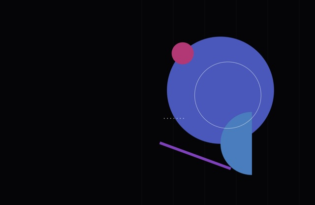<br><b><code>bauhaus</code></b><br><sub>Geometric poster: circles, half-circles, stripes</sub></td></tr>
<tr><td width="33%" valign="top"><br><b><code>mesh</code></b><br><sub>Large blurred color blobs drifting over the day</sub></td><td width="33%" valign="top">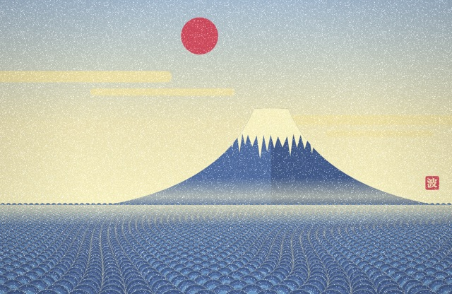<br><b><code>kanagawa</code></b><br><sub>Fuji, seigaiha sea and kasumi mist, after Hokusai</sub></td></tr>
</table>

## Make your own

```swift
// icons/wallpaper-<name>.swift
runWallpaper { hour in
    let ctx = canvas()                     // near-black canvas
    let (a, b) = tint(hour)                // colors for this time of day
    radialGlow(ctx, CGPoint(x: W / 2, y: H / 2), 400 * S, a, 0.3)
    return bloom(ctx.makeImage()!)
}
```

Shared pieces — palette, `tint(hour)`, `daylight(hour)`, stars, glow, bloom and the HEIC builder — live in
[`icons/wallpaper-kit.swift`](../icons/wallpaper-kit.swift). Then `wall <name>` builds and applies it.
