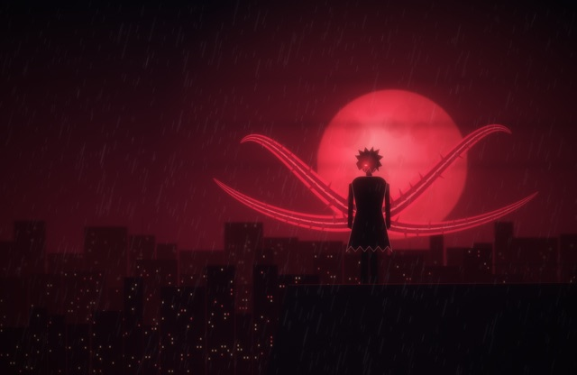
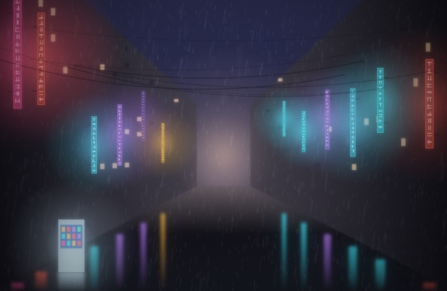
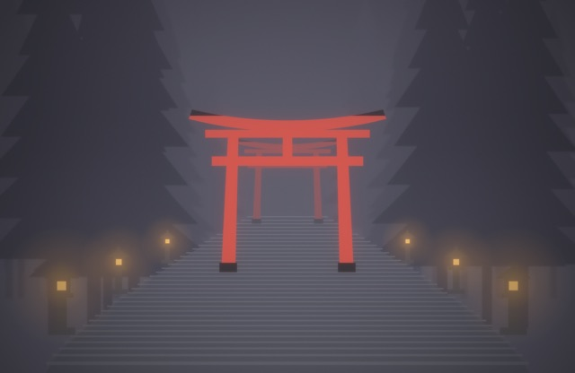
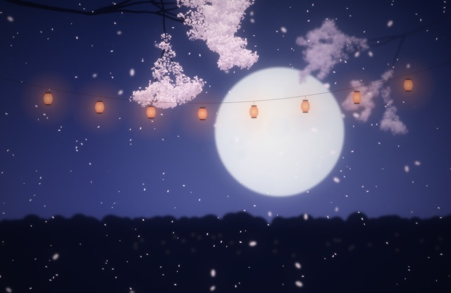
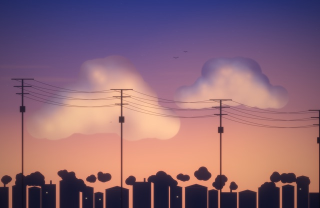
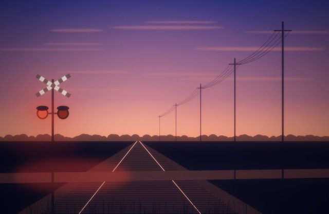
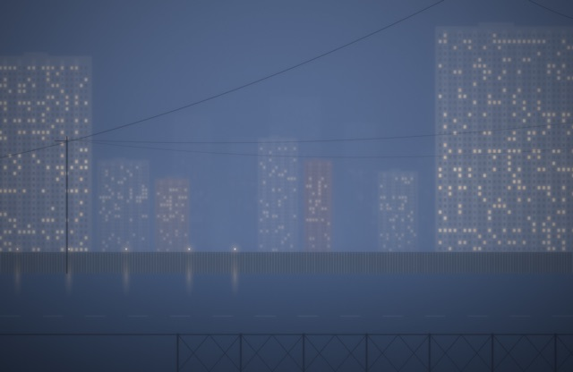
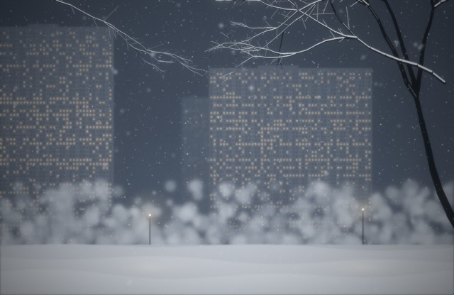
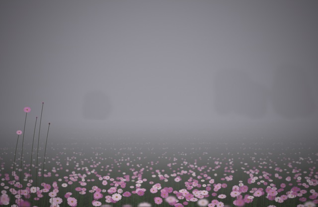
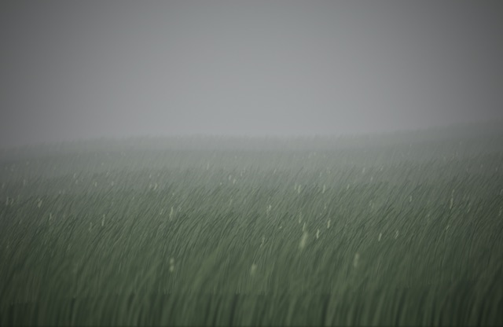

# Wallpapers

Every wallpaper is a Swift script in [`icons/`](../icons) that paints a scene in code at screen resolution
(2560×1664) and renders a dynamic HEIC: 12 frames through the day, macOS blends between them.
Apply one with `wall <name>`, or run `wall` to pick from a list with image previews.
`backdrop <name>` puts a dark, readable version of any of them behind the terminal.

Previews show the hour that suits each scene best.

## Dark anime

<table>
<tr><td width="33%" valign="top"> <b><code>ghoulnight</code></b> A city in the rain under a huge red moon; on the roof edge, a silhouette with one red eye and four tendrils (an original character)</td><td width="33%" valign="top"> <b><code>rainalley</code></b> A narrow Tokyo alley in the rain: neon signs without readable text, a vending machine, reflections on wet asphalt</td></tr>
</table>

## Japan

<table>
<tr><td width="33%" valign="top"> <b><code>torii</code></b> Stone steps climbing into fog through red torii gates, stone lanterns and cedars; the lanterns light up at night</td><td width="33%" valign="top"> <b><code>sakuranight</code></b> Cherry branches, a full moon, a string of paper lanterns and falling petals</td><td width="33%" valign="top"> <b><code>hanami</code></b> Cherry blossom at dusk over a bridge and dark water; a lamp comes on at night</td></tr>
</table>

## Twilight

<table>
<tr><td width="33%" valign="top"> <b><code>twilight</code></b> Anime dusk: towering clouds lit from below, power lines and a small town in silhouette</td><td width="33%" valign="top"> <b><code>crossing</code></b> A railway crossing at dusk: rails to the horizon, the red signal blinking, wires along the track</td></tr>
</table>

## Fog & weather

<table>
<tr><td width="33%" valign="top"> <b><code>mistcity</code></b> Panel high-rises sinking into blue fog, wires, a fence and warm windows that light up floor by floor</td><td width="33%" valign="top"> <b><code>snowfall</code></b> A courtyard in a snowstorm: tall blocks in the haze, snow-laden branches, flakes in three depths</td><td width="33%" valign="top"> <b><code>cosmea</code></b> A field of pink cosmos fading into thick fog, a few tall stems in focus</td></tr>
<tr><td width="33%" valign="top"> <b><code>steppe</code></b> Tall grass bent by the wind, the hill dissolving into mist</td></tr>
</table>

## Your photos

`wall add <photo> [name]` adds any picture (for example anime art you downloaded for yourself). Photos live in the
git-ignored `wallpapers/photos/` and never reach the public repo; `backdrop <name>` works for them too.

## Make your own

Create `icons/wallpaper-<name>.swift` with `runWallpaper { hour in … }` and run `wall <name>`.
`icons/wallpaper-kit.swift` has the building blocks: `haze` (fog between planes), `soften` (depth of field),
`blurLayer`, `filmic` (grain and vignette), `bloom`, `lamp`, `stars`, panel `tower`s, `wire`s and sakura `blossomTree`s.
